# GRRLIB Examples Collection

GRRLIB Examples Collection is a collection of all* of the examples bundled with GRRLIB. 19 examples are available:

| Preview | Description                                                                                   |
|-------------------------------------------------|-----------------------------------------------------------------------------------------------|
| 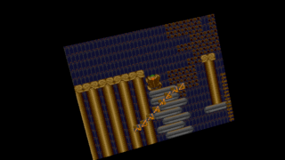 | 3D_CubedTileDemo is TileDemo but it's a rotating cube. |
| 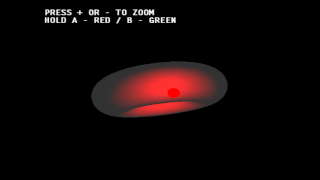 | 3D_Light1 uses a rotating torus and two orbs to show GRRLIB lighting. |
| 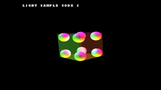 | 3D_Light2 uses 8 lit balls around the vertices of a rotating cube to demonstrate advanced GRRLIB lighting. |
| 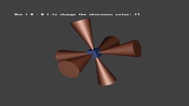 | 3D_Light3 has cones and a cube with a configurable shininess value. |
| 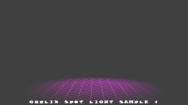 | 3D_Light4 uses moving red and light spotlights to show the spot lighting capabilities of GRRLIB. |
| 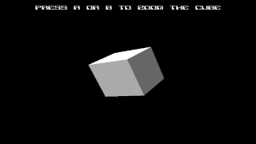 | 3D_sample1 has a rotating 3D cube as an example of basic 3D rendering. |
| 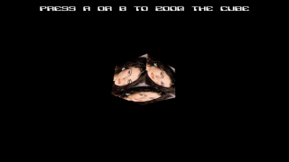 | 3D_sample2 has a rotating 3D cube but with textures. |
| 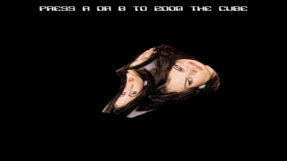 | 3D_sample3 has a textured cube with a sine wave distortion effect. |
| 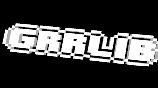 | 3D_sample4 displays a spinning 3D model of the GRRLIB logo. |
| 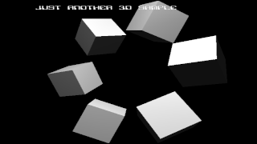 | 3D_sample5 has 8 rotating cubes with flat shading in a ring. |
| 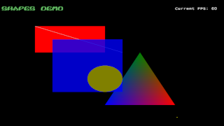 | basic_drawing shows the text, sprite, and image rendering of GRRLIB on multiple pages. |
| 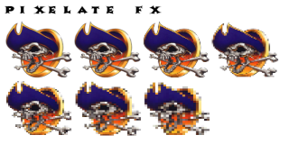 | bitmap_fx shows the various effects you can apply to bitmaps on multiple pages. |
| 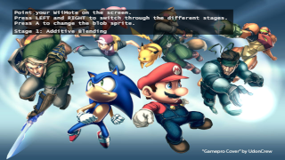 | blending demonstrates GRRLIB's various blending modes with a blob you can move with the Wii Remote. |
| 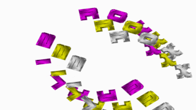 | compositing uses GRRLIB's compositing modes to change the colors of text in a circle. |
| 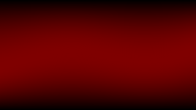 | funsin displays a dynamic sinusoidal wave pattern. |
| 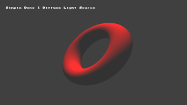 | NEED_GRRLIB_FUNCTION shows effects using a 3D torus, including diffuse, specular, and environmental mapping. |
| 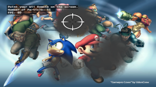 | particle lets you shoot smoke particles at the screen using the Wii remote. |
| 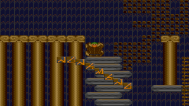 | TileDemo demonstrates basic tile-based graphics with character movement and background rendering. |
| 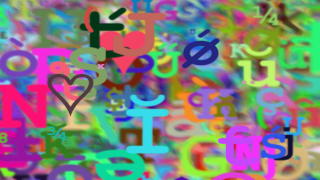 | ttf shows off the TTF loading features of GRRLIB with a random display of letters and colors! |

*unlimited2d and unlimited2d have been excluded due to bugs.
